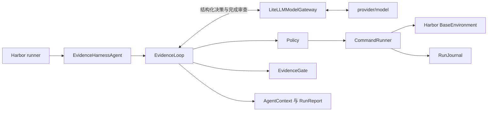

# Evidence Harness

Evidence Harness 是面向 Terminal-Bench 2.0 的 Harbor 自定义 Agent。它通过外部
`BaseAgent` 控制隔离任务容器，使用单写者执行循环，并把最后一次修改之后产生的
新鲜验证回执作为内部完成条件。

## 项目特色

Evidence Harness 的重点不是增加 Agent 角色，而是把完成判断从模型的自然语言声明改成
控制器可执行的协议。

- **完成必须有可执行证据。** `finish` 必须提交一到三条只读检查，以及任务要求与检查
  ID 的覆盖表。Harness 自己执行检查，模型不能自行宣布检查通过。
- **证据绑定工作版本。** 每次 `execute` 都推进 `work_epoch` 并清除旧验证。环境发生
  后续操作后，先前成功的检查不能继续用于完成判定。
- **验证预算不会被工作命令耗尽。** 控制器为最终检查预留环境调用次数。模型即使在解题
  阶段耗费过多调用，也不能占用这部分预算。
- **环境只有一个写者。** executor 通过 `CommandRunner` 串行执行命令。completion
  reviewer 只检查覆盖关系，没有环境引用，因此不会与 executor 竞争任务状态。
- **保留通用 Shell，但约束控制协议。** Harness 不依赖某种语言的 AST 或补丁格式，
  因此能覆盖运维、服务配置、安全、数据处理和代码修改任务。模型仍必须返回严格的
  `execute`、`finish`、`replan` 或 `stop` 对象。
- **上下文和日志可以复查。** 每轮提示都从 `RunState` 重建，不累积完整聊天记录。
  `RunJournal` 保存脱敏后的完整输出，模型只接收有界摘录、哈希和日志引用。
- **不把未运行写成失败。** 评测汇总明确区分 `not_run`、`error` 和 `failed`。内部
  `verified` 也不替代 Harbor verifier 的最终 reward。

## 架构总览

模型负责选择动作，Harness 负责执行、记账和终止。模型不能直接访问任务容器。



一次运行按以下顺序推进：

1. Harness 执行固定的只读 bootstrap，收集目录、平台、Git 状态和工具信息。
2. 模型根据原始任务、预算、当前计划和最近观察选择一个结构化动作。
3. 对于 `execute`，Policy 先检查命令，`CommandRunner` 再串行操作任务容器。
4. 对于 `finish`，启用 completion review 时，只读 reviewer 检查任务要求与检查命令的
   覆盖关系。
5. Harness 重新执行一到三条只读检查。检查全部成功且属于当前 `work_epoch` 时，
   `EvidenceGate` 才接受完成声明。

完整的组件职责、状态机、证据模型和设计取舍见
[架构决策](docs/architecture-rationale.md)。

## 环境

需要 Python 3.12、`uv` 和 Docker。

```bash
uv sync --python 3.12
docker info
```

项目固定 `harbor==0.23.0`，避免 Harbor 插件接口升级导致无法复现实验。

## 单题运行

先按 LiteLLM 供应商约定配置 API key，再执行：

```bash
uv run harbor run \
  --dataset terminal-bench@2.0 \
  --include-task-name fix-git \
  --agent evidence_harness.harbor_agent:EvidenceHarnessAgent \
  --model provider/model \
  --n-concurrent 1
```

常用预算通过 `--agent-kwarg` 调整：

```bash
uv run harbor run \
  --dataset terminal-bench@2.0 \
  --include-task-name fix-git \
  --agent evidence_harness.harbor_agent:EvidenceHarnessAgent \
  --model provider/model \
  --agent-kwarg max_turns=40 \
  --agent-kwarg max_environment_calls=80 \
  --agent-kwarg max_wall_time_sec=1800
```

每个 trial 会在 Harbor 的 Agent 日志目录中写入
`evidence-harness/events.jsonl` 和脱敏后的完整命令输出。Harness 提示只携带有界
首尾摘录和摘要哈希。

## 固定 10 题评测

[`evaluation/matrix.json`](evaluation/matrix.json) 固定了 3 easy、4 medium、3 hard
共 10 题。它只依据公开 `task.toml` 元数据分层选样，不读取 verifier 或 solution。

当前快照已评分 6/10 题，5 题通过、1 题失败。5 题使用 live 模型调用，1 题使用
已记录决策 replay；[`evaluation/results.md`](evaluation/results.md) 明确标注每题模式。

先验证任务选择和 Harbor 配置，不调用模型：

```bash
uv run python scripts/run_evaluation.py \
  --model provider/model \
  --dry-run
```

真实运行：

```bash
uv run python scripts/run_evaluation.py \
  --model provider/model \
  --env-file /absolute/path/to/provider.env \
  --debian-https-sources \
  --n-concurrent 1
```

GLM 5.3 端点在并发 2 时出现过成批空响应和长时间停滞，并发 1 的重跑也发生过单请求
停滞。当前评测固定使用 `--n-concurrent 1`，在模型服务稳定后再提高并发。单题校准可以
重复传入 `--include-task-name`：

```bash
uv run python scripts/run_evaluation.py \
  --model provider/model \
  --env-file /absolute/path/to/provider.env \
  --include-task-name fix-git \
  --debian-https-sources \
  --n-concurrent 1
```

汇总结果：

```bash
uv run python scripts/summarize_results.py runs/terminal-bench-2/<job-name> \
  --json-out evaluation/results.json \
  --markdown-out evaluation/results.md
```

汇总器将未执行任务标为 `not_run`，将缺少 reward 或出现异常的任务标为 `error`。
报告同时给出 attempted pass rate 和 scored pass rate。`error` 进入前者但不进入后者，
`not_run` 不进入两者。execution coverage 仍记录已启动的任务。`execution_mode` 区分
`live`、`replay` 和 `not_run`，replay 不表示一次新的模型调用。

## 验证

```bash
uv run ruff check .
uv run mypy src scripts tests
uv run pytest --cov=evidence_harness
uv build
uv run harbor agent schema evidence_harness.harbor_agent:EvidenceHarnessAgent
uv run harbor agent schema evidence_harness.replay_agent:JournalReplayAgent
```

本地 smoke test 使用 OpenAI 兼容 mock server 和真实 Docker/Harbor 链路，验证 Agent
适配、执行、证据审查及官方 verifier：

```bash
uv run python scripts/mock_openai_server.py --port 18080

OPENAI_API_KEY=test-key uv run harbor run \
  --path tests/fixtures/hello-world \
  --agent evidence_harness.harbor_agent:EvidenceHarnessAgent \
  --model openai/mock-model \
  --agent-kwarg api_base=http://127.0.0.1:18080/v1 \
  --agent-kwarg max_turns=6 \
  --agent-kwarg max_environment_calls=10 \
  --n-concurrent 1
```

## 文档

- [架构决策](docs/architecture-rationale.md)
- [评测报告](docs/evaluation-report.md)
- [当前矩阵快照](evaluation/results.md)
- [独立 fix-git replay 结果](evaluation/replay-results.md)
- [失败分析](docs/failure-analysis.md)
- [后续 10 小时优先级](docs/next-10-hours.md)
- [Vibe Coding 日志](docs/vibe-coding-log.md)
