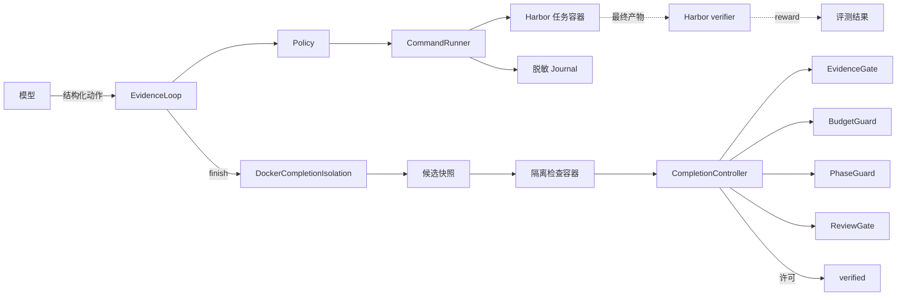

<div align="center">

<h1>Evidence Harness</h1>

<p><strong>用可执行证据约束终端 Agent 的完成判定</strong></p>

<p>
  面向 Terminal-Bench 2.0 的 Harbor Agent。模型提出动作，控制器执行命令、保存回执，
  并根据新鲜证据决定任务能否结束。
</p>

<p>
  <a href="https://github.com/Duang777/Dharness/actions/workflows/ci.yml">
    
  </a>
  
  
  
</p>

<p>
  <a href="#安装">安装</a> ·
  <a href="#架构">架构</a> ·
  <a href="#成绩">成绩</a> ·
  <a href="#运行评测">运行评测</a> ·
  <a href="#交付文档">文档</a>
</p>

</div>

| Terminal-Bench 2.0 | 通过率 | Canonical error | 评分覆盖率 |
|:---:|:---:|:---:|:---:|
| **59 / 89** | **66.3%** | **0** | **100%** |

> [!NOTE]
> 评测结果包含受控恢复和 4 个 journal replay，不应解读为严格的 pass@1。
> Harbor reward 始终是最终评分依据。

## 核心亮点

语言模型可以生成命令，但它不应同时成为执行记录、系统状态和完成判定的唯一来源。
Evidence Harness 把这些职责分开：

| 模型 | Harness | Harbor |
|---|---|---|
| 提出 `execute`、`finish`、`replan` 或 `stop` | 执行命令，维护预算，并验证完成证据 | 在 Agent 退出后独立计算 benchmark reward |

模型不能直接访问任务容器，也不能用自然语言宣布成功。每次 `finish` 都必须覆盖运行开始时
冻结的 requirements，并在候选快照中重新执行检查。

## 安装

需要 Python 3.12 或 3.13、[`uv`](https://docs.astral.sh/uv/) 和可用的 Docker daemon。

```bash
git clone https://github.com/Duang777/Dharness.git
cd Dharness
uv sync --python 3.12
docker info
```

运行一个 Terminal-Bench 任务：

```bash
uv run harbor run \
  --dataset terminal-bench@2.0 \
  --include-task-name fix-git \
  --agent evidence_harness.harbor_agent:EvidenceHarnessAgent \
  --model provider/model \
  --n-concurrent 1
```

把 `provider/model` 替换为实际模型。通过进程环境提供凭证，不要把凭证写入命令、
README 或 Git。

## 架构



一次完成判定经过以下步骤：

1. `CompletionContract` 在运行开始时冻结 requirements、证据类型和预算。
2. 模型提交 `finish` 时，Harness 暂停源容器并创建候选快照。
3. 每条检查在独立的无挂载、无网络子容器中运行。
4. `CompletionController` 合取证据、预算、阶段和 review 结果。
5. Agent 退出后，Harbor verifier 独立评估最终产物。

[架构决策](docs/architecture-rationale.md)记录了状态机、模块边界和候选快照协议。
[Completion control 设计](docs/completion-control-design.md)说明了固定契约和控制器门禁。

### 运行时保证

| 保证 | 实现 |
|---|---|
| 固定完成范围 | `CompletionContract` 冻结 requirement ID，模型不能靠漏报缩小验收范围 |
| 新鲜证据 | `work_epoch`、`attempt_id` 和 `candidate_digest` 共同绑定每条完成回执 |
| 隔离检查 | 每条检查使用同一候选镜像，但运行在独立、无网络、无挂载的子容器中 |
| 单写者 | 只有 `CommandRunner` 可以修改 Harbor 任务环境 |
| 有界恢复 | turn、环境调用、repair、recovery 和墙钟分别计数 |
| 可审计记录 | 完整输出进入脱敏 journal，模型上下文只接收有界摘录和 SHA-256 |

## 成绩

固定矩阵覆盖官方 Terminal-Bench 2.0 的全部 89 题。85 题由
`openai/modelhub/gpt-5.6-terra` 实时运行，4 题重放同批运行中保存的 Agent 命令，
用于恢复 verifier 超时或环境中断后的评分。

| 指标 | 最终结果 |
|---|---:|
| 已执行并评分 | 89 / 89 |
| Harbor reward 1.0 | 59 |
| Harbor reward 0 | 30 |
| Canonical error | 0 |
| Attempted / scored pass rate | 66.3% / 66.3% |
| Execution / scored coverage | 100% / 100% |

### 分组结果

| 分组 | 通过 | 失败 | 通过率 |
|---|---:|---:|---:|
| easy | 4 / 4 | 0 | 100.0% |
| medium | 42 / 55 | 13 | 76.4% |
| hard | 13 / 30 | 17 | 43.3% |
| Terra live | 57 / 85 | 28 | 67.1% |
| journal replay | 2 / 4 | 2 | 50.0% |

评测暴露了两个不同的信号。85 个 live trial 中，有 10 个内部 `verified` 但 reward 为 0；
另有 12 个 reward 为 1.0 的任务没有以 `verified` 结束。因此，Harness 的完成状态用于
诊断控制循环，Harbor reward 用于计算成绩。

完整数据与统计口径：

- [全量评测报告](docs/evaluation-report.md)
- [89 题逐题结果](evaluation/results-89.md)
- [Canonical 选择清单](evaluation/canonical-89.json)
- [失败分析](docs/failure-analysis.md)

## 运行评测

先验证矩阵和 Harbor 参数。这个命令不调用模型：

```bash
uv run python scripts/run_evaluation.py \
  --model provider/model \
  --dry-run
```

运行固定 10 题：

```bash
uv run python scripts/run_evaluation.py \
  --model provider/model \
  --debian-https-sources
```

全量运行使用可恢复的串行编排器。每题保存为独立 Harbor job，再次使用相同
`--run-name` 时会跳过已有 `result.json` 的任务：

```bash
uv run python scripts/run_full_evaluation.py \
  --matrix evaluation/matrix-89.json \
  --run-name full89-provider-YYYYMMDD \
  --model provider/model \
  --agent-kwarg max_output_tokens=8192 \
  --agent-kwarg max_model_call_timeout_sec=360
```

默认并发为 1。可以通过 `--agent-kwarg` 调整 turn、环境调用和墙钟预算。详细参数、
恢复约束和结果冻结流程见[评测报告](docs/evaluation-report.md)。

### PrefixBench

PrefixBench 使用冻结的 development 和 held-out test split，研究控制器事件日志中的
目标不变量。采集 profile 会把 commit、tree 和 runtime source SHA-256 写入 journal，
并拒绝与 `git archive HEAD` 不一致的运行时代码。

- [采集与来源绑定](docs/prefixbench-collection-design.md)
- [Development mutation campaign](docs/prefixbench-mutation-campaign-design.md)
- [Held-out test campaign](docs/prefixbench-test-mutation-campaign-design.md)
- [分析口径](docs/prefixbench-analysis-design.md)

## 完整验收

运行完整门禁：

```bash
uv run python scripts/verify_all.py
```

该命令依次运行 Ruff、mypy、pytest coverage、包构建、Harbor schema 检查、评测 dry-run、
冻结产物复算、凭证扫描，以及 mock model、Docker 和 Harbor verifier smoke。

没有 Docker 时，只跳过最后的 smoke：

```bash
uv run python scripts/verify_all.py --skip-smoke
```

## 工程方法与知识覆盖

仓库包含 Agent 运行时、可恢复评测编排器、冻结评测产物和 PrefixBench 研究工具。
评测任务覆盖系统运维、软件工程、数据处理、科学计算、安全、编译器和逆向工程。
每项结论只基于已提交的运行结果与回执。

工程决策记录在 [AI Coding 工程日志](docs/vibe-coding-log.md)，复现范围与检查规则见
[复现检查设计](docs/thesis-reproduction-checker-design.md)。

## 仓库结构

```text
.
├── src/evidence_harness/           # Agent 运行时与完成控制
├── src/evidence_harness_mutation/  # PrefixBench mutation 与分析
├── scripts/                        # 评测、冻结、报告与验证命令
├── evaluation/                     # 固定矩阵、canonical 清单与结果
├── experiments/                    # 冻结实验协议
└── docs/                           # 架构、评测与复现说明
```

## 交付文档

| 主题 | 入口 |
|---|---|
| 全部文档 | [文档索引](docs/README.md) |
| 系统架构 | [架构决策](docs/architecture-rationale.md) |
| 完成协议 | [Completion control 设计](docs/completion-control-design.md) |
| 隔离验证 | [隔离完成验证设计](docs/isolated-verification-design.md) |
| 评测结果 | [Terminal-Bench 2.0 评测报告](docs/evaluation-report.md) |
| PrefixBench | [研究设计](docs/prefixbench-design.md) |
| 复现实验 | [复现检查设计](docs/thesis-reproduction-checker-design.md) |
| 工程记录 | [AI Coding 工程日志](docs/vibe-coding-log.md) |

## 结果与限制

- 最终 59/89 包含受控恢复和 journal replay，不是严格 pass@1。
- 三个安全任务被模型供应商的 `cyber_policy` 拒绝。
- 冻结快照可以复算已提交结果，但完整命令输出仍保存在未提交的原始运行目录中。
- 89 题隔离支持 census 是静态检查，不等同于逐题启动容器验证。

## 参与贡献

通过 [GitHub Issues](https://github.com/Duang777/Dharness/issues) 报告问题或提出改进。
提交代码前运行[完整门禁](#完整验收)。CI 会在 push 和 pull request 上执行相同检查。
