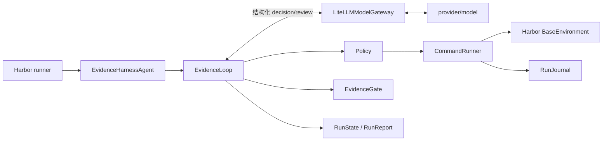

# Evidence Harness

Evidence Harness 是面向 Terminal-Bench 2.0 的 Harbor 自定义 Agent。它把“任务完成”
改造成控制器执行的证据协议：模型提出操作和验收条件，Harness 串行执行命令、保存观察、
重新运行最终检查，只有新鲜证据覆盖全部任务要求时才结束。

## 成绩

扩展矩阵覆盖 4 easy、10 medium、6 hard，共 20 个系统运维、软件工程、安全、数据处理、
科学计算和数学任务。

| 指标 | 当前结果 |
|---|---:|
| 已尝试 | 20 / 20 |
| Harbor reward 1.0 | 18 |
| 普通 verifier 失败 | 1 |
| 基础设施错误 | 1 |
| Attempted pass rate | 90% |
| Scored pass rate | 94.7% |
| Execution / scored coverage | 100% / 95% |

这不是同一模型的一次完整 20 题成绩。18 个通过结果由 17 个 live trial 和 1 个 journal
replay 组成；live trial 使用 GLM 5.3 与 `modelhub/gpt-5.6-terra`。评分失败
`vulnerable-secret` 被模型供应商的 `cyber_policy` 拒绝；唯一基础设施错误
`qemu-startup` 发生在 Apple Silicon 宿主的 Rosetta amd64 容器中。逐题模型、模式、
reward 和停止原因见[20 题冻结评测结果](evaluation/results-20.md)。

## 核心亮点

- **完成声明必须带证据。** `finish` 给出一到三条检查命令和 requirement-to-check
  覆盖表。Harness 自己执行检查，模型不能用自然语言宣布成功。
- **证据绑定当前工作版本。** 每次变更推进 `work_epoch` 并使旧检查失效，避免
  “先测试、后改坏、仍然结束”。
- **最终验证有独立预算。** executor 不能把全部环境调用消耗在探索阶段。
- **单写者消除状态竞争。** 只有 `CommandRunner` 能操作 Harbor 环境；completion
  reviewer 只审查覆盖关系，不持有环境对象。
- **上下文按状态重建。** 每轮 prompt 从 `RunState`、计划、预算和有界观察生成。完整
  输出脱敏后进入 journal，prompt 只携带首尾摘录、摘要哈希和引用。
- **模型异常可恢复。** 空正文进入一次 schema repair；executor 和 reviewer 都有独立
  模型调用超时；重复失败会触发 replan 或分类停止。
- **报告不美化失败。** `passed`、`failed`、`error`、`not_run` 以及
  `live`、`replay` 分开统计。内部 `verified` 不能替代 Harbor reward。
- **结果可以从仓库复算。** `evaluation/trials-20/` 保存 20 个脱敏 trial 快照和原始
  结果 SHA-256，不保存 API 地址、凭证、绝对路径或 traceback。

## 架构

模型负责选择动作，Harness 负责执行、记账和决定是否终止。模型不能直接访问任务容器。



| 设计问题 | Evidence Harness 的实现 |
|---|---|
| Prompt 构造 | 原始任务 + 环境 bootstrap + 当前计划 + 预算 + 有界观察 + 严格动作 schema |
| 执行策略 | 轻量 plan-in-action；每轮选择 `execute`、`finish`、`replan` 或 `stop` |
| 错误恢复 | 命令分类、schema repair、模型超时、重复周期检测、恢复预算 |
| 上下文管理 | 从状态重建 prompt；大输出写 journal，只传摘录与 SHA-256 |
| 终止判断 | reviewer 审覆盖，Harness 重跑 checks，EvidenceGate 校验 epoch 与结果 |

完整状态机、组件职责、方案比较和取舍见[架构决策](docs/architecture-rationale.md)。

## 安装

需要 Python 3.12、[`uv`](https://docs.astral.sh/uv/) 和可用的 Docker daemon。

```bash
uv sync --python 3.12
docker info
```

项目固定 `harbor==0.23.0`。模型凭证放在供应商环境变量或仓库外的 env 文件中；不要把
key 写入命令、README 或 Git。

创建权限为 `0600` 的临时 env 文件：

```bash
umask 077
read -rs EVIDENCE_HARNESS_KEY
printf 'OPENAI_API_KEY=%s\n' "$EVIDENCE_HARNESS_KEY" > /tmp/evidence-harness.env
unset EVIDENCE_HARNESS_KEY
```

## 运行评测

运行单题：

```bash
uv run harbor run \
  --dataset terminal-bench@2.0 \
  --include-task-name fix-git \
  --agent evidence_harness.harbor_agent:EvidenceHarnessAgent \
  --model provider/model \
  --n-concurrent 1
```

验证固定矩阵和 Harbor 参数，不调用模型：

```bash
uv run python scripts/run_evaluation.py \
  --model provider/model \
  --dry-run
```

串行运行固定 10 题：

```bash
uv run python scripts/run_evaluation.py \
  --model provider/model \
  --env-file /absolute/path/to/provider.env \
  --debian-https-sources
```

默认并发是 1。真实运行中，GLM 端点在并发 2 时出现过成批空响应和停滞。可重复传入
`--include-task-name` 运行矩阵子集。runner 接受任意非空矩阵，因此可以直接扩展到 20 题：

```bash
uv run python scripts/run_evaluation.py \
  --matrix evaluation/matrix-20.json \
  --model openai/modelhub/gpt-5.6-terra \
  --env-file /tmp/evidence-harness.env \
  --debian-https-sources \
  --agent-kwarg api_base=https://xpa-relay.bytedance.net/v1 \
  --agent-kwarg max_output_tokens=8192 \
  --agent-kwarg max_model_call_timeout_sec=360
```

`api_base` 必须停在 `/v1`。LiteLLM 会追加 `/chat/completions`，因此不要把完整请求路径
传给 `api_base`。`openai/` 是 LiteLLM provider 前缀，实际发送的模型名仍是
`modelhub/gpt-5.6-terra`。

评测预算可用 `--agent-kwarg max_turns=...`、
`--agent-kwarg max_environment_calls=...` 和
`--agent-kwarg max_wall_time_sec=...` 调整。

## 完整验收

一条命令运行 Ruff lint/format、mypy、pytest coverage、构建、两个 Harbor Agent
schema、10/20 题 dry-run、交付物检查、结果复算、凭证扫描，以及真实 mock-model +
Docker + Harbor verifier smoke：

```bash
uv run python scripts/verify_all.py
```

没有 Docker 时可仅跳过最后的 smoke：

```bash
uv run python scripts/verify_all.py --skip-smoke
```

从原始 Harbor 目录生成可提交的脱敏快照，再重建 10 题报告：

```bash
uv run python scripts/freeze_evaluation.py /path/to/harbor/job
uv run python scripts/summarize_results.py evaluation/trials \
  --json-out evaluation/results.json \
  --markdown-out evaluation/results.md
uv run python scripts/verify_delivery.py
```

20 题结果可以由多个互不重叠的 Harbor job 或单题 trial 目录合并。每个任务必须恰好
出现一次；冻结器会拒绝重复、缺失或矩阵外任务：

```bash
uv run python scripts/freeze_evaluation.py \
  runs/terminal-bench-2/<original-10-job> \
  runs/terminal-bench-2/<expanded-job>/<selected-trial> \
  runs/terminal-bench-2/<recovery-job>/<selected-trial> \
  --matrix evaluation/matrix-20.json \
  --output-dir evaluation/trials-20

uv run python scripts/summarize_results.py evaluation/trials-20 \
  --matrix evaluation/matrix-20.json \
  --json-out evaluation/results-20.json \
  --markdown-out evaluation/results-20.md
```

本地 smoke 使用固定 fixture 和确定性 mock server，只证明 Harness、Docker、Harbor 与
verifier 的集成链路，不计入 Terminal-Bench 成绩。

## 结果与限制

- 当前结果来自混合模型和一次 replay，不能解读为单模型排行榜成绩。
- `qemu-startup` 需要原生 x86_64 Linux 或支持相应系统调用与嵌套虚拟化的 runner。
- `vulnerable-secret` 连续两次被供应商 `cyber_policy` 拒绝。该结果反映当前模型通道的
  策略边界，不是 verifier 基础设施错误。
- `overfull-hbox` 与 `model-extraction-relu-logits` 已获 reward 1.0，但 reviewer 曾要求
  运行会生成 PDF、日志或 `.npy` 的检查。只读 policy 不允许它们写任务目录，因此内部
  状态为 `budget_exhausted`。正确改进是隔离验证工作区，不是放开任意写入。
- 扩展批次发现的 `query-optimize` 性能不足、Docker 拉取 EOF 和 `dna-assembly` 产物
  语义验证缺口均已通过独立 recovery trial 复测。

## 交付文档

- [架构决策](docs/architecture-rationale.md)
- [评测报告](docs/evaluation-report.md)
- [20 题逐题结果与统计口径](evaluation/results-20.md)
- [首批 10 题冻结结果](evaluation/results.md)
- [首批 10 题逐题分析](docs/ten-task-analysis.md)
- [失败分析](docs/failure-analysis.md)
- [如果再给 10 小时](docs/next-10-hours.md)
- [Vibe Coding 日志](docs/vibe-coding-log.md)
- [独立 fix-git replay 结果](evaluation/replay-results.md)
