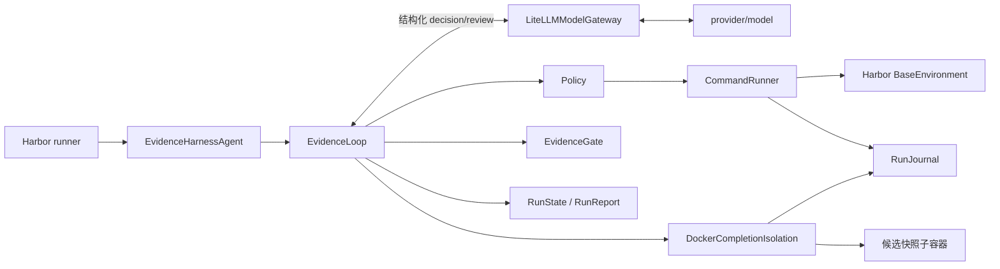

# Evidence Harness

Evidence Harness 是面向 Terminal-Bench 2.0 的 Harbor 自定义 Agent。它把“任务完成”
改造成控制器执行的证据协议：模型提出操作和验收条件，Harness 串行执行命令、保存观察、
在候选快照中重新运行最终检查，只有新鲜证据覆盖全部任务要求时才结束。

Terminal-Bench 2.0 全量评测已经完成。最终结果为 59/89，全部任务均已评分，
canonical `error` 为 0。

## 成绩

固定矩阵覆盖官方 Terminal-Bench 2.0 的全部 89 题。85 个任务使用
`openai/modelhub/gpt-5.6-terra` 实时运行，4 个任务使用同一批运行中保存的 Agent
命令进行 journal replay，以恢复被 verifier 超时或运行环境中断的评分。

| 指标 | 最终结果 |
|---|---:|
| 已执行并评分 | 89 / 89 |
| Harbor reward 1.0 | 59 |
| Harbor reward 0 | 30 |
| Canonical error | 0 |
| Attempted / scored pass rate | 66.3% / 66.3% |
| Execution / scored coverage | 100% / 100% |

首轮结果为 46 passed、23 failed、20 error。按故障域恢复并复核后，最终 canonical
相较首轮增加 13 个 passed、7 个可评分 failed，并清除全部 20 个 error。逐题 reward、
执行模式和停止原因见
[89 题冻结评测结果](evaluation/results-89.md)。选择来源和完成时间保存在
[`canonical-89.json`](evaluation/canonical-89.json)，每个原始 `result.json` 都由
SHA-256 绑定。

### 如何解读成绩

本项目同时报告两种通过率。Attempted pass rate 以全部已运行任务为分母，能暴露模型、
Harness 和基础设施共同造成的损失。Scored pass rate 只统计 verifier 正常给出评分的
任务，用于区分解题失败与运行环境错误。

| 分组 | 通过 | 失败 | 通过率 |
|---|---:|---:|---:|---|
| easy | 4 / 4 | 0 | 100.0% |
| medium | 42 / 55 | 13 | 76.4% |
| hard | 13 / 30 | 17 | 43.3% |
| Terra live | 57 / 85 | 28 | 67.1% |
| journal replay | 2 / 4 | 2 | 50.0% |

85 个 live canonical trial 都使用 Terra 模型和并发 1，但来自受控恢复运行，期间
Harness 配置和源码有修订。replay 不发起新模型调用，只重放已记录的命令，并保留源
journal SHA-256。最终成绩反映含恢复的工程闭环，不是严格 pass@1。

### 实验结论

1. **Harbor reward 必须保持最终权威。** 85 个 live trial 中有 10 个内部
   `verified` 但 reward 为 0，另有 12 个 reward 1.0 的任务未以 `verified` 结束。
   内部状态与外部评分共出现 22 次错位。
2. **预算是主要失败边界。** 10 个失败在预算耗尽时仍未交付合格产物，其中 9 个属于
   `harness_control`，1 个属于 completion 协议。hard 组通过率为 43.3%，低于 medium
   组的 76.4%。
3. **模型通道直接造成 4 个失败。** 三个安全任务触发 `cyber_policy`；`caffe-cifar-10`
   在耗尽墙钟后只剩 0.001 秒模型调用预算，训练产物未完成。
4. **恢复流程清除了基础设施错误。** Docker EOF、镜像启动超时和 verifier 超时没有
   留在最终 `error` 中。恢复后要么得到 reward 1.0，要么得到可归因的 reward 0。

## 核心亮点

这里的亮点只描述 Harness 的运行时设计。评测统计、文档和 Skills 放在后续独立章节。

| 设计亮点 | Harness 的实现 |
|---|---|
| 结构化动作协议 | 模型只能返回 `execute`、`finish`、`replan` 或 `stop`。Pydantic 在模型边界解析动作，格式错误只允许一次 schema repair |
| 证据驱动的完成协议 | `finish` 必须提交检查命令和 requirement-to-check 覆盖表。Harness 在候选快照中重跑检查，模型不能用自然语言自行宣布成功 |
| 隔离完成检查 | 每条检查从同一 Docker 候选镜像启动独立的无挂载、无网络子容器。源容器保持暂停，检查结束后校验源 diff 并清理全部临时资源 |
| 基于 epoch 的证据新鲜度 | 每次修改环境都会推进 `work_epoch`。旧检查立即失效，避免修改后继续复用过期的通过结果 |
| 单写者执行边界 | 只有 `CommandRunner` 可以调用 Harbor 环境。executor 和 reviewer 不会并发修改同一个容器 |
| 独立的完成审查 | completion reviewer 只判断检查是否覆盖原始要求，不持有环境对象，也不执行命令 |
| 状态投影式上下文 | 每轮 prompt 从 `RunState` 重建，只包含当前计划、剩余预算和有界观察。完整输出写入脱敏 journal |
| 分层恢复机制 | 命令失败触发分类处理，协议错误进入 repair，重复周期触发 replan，模型停滞由独立超时截断 |
| 有界预算与明确停止 | turn、环境调用、repair、recovery 和墙钟时间分别计数。预算耗尽后返回明确的停止原因，不无限循环 |
| 内外两层验收 | `EvidenceGate` 判断 Harness 是否具备完成证据，Harbor verifier 决定 benchmark reward。内部 `verified` 不覆盖外部评分 |

## 工程方法与知识覆盖

开发过程使用了五项可追踪的 Skills：

| Skill | 在项目中的作用 |
|---|---|
| `show-me-your-work` | 把工程决定写入 TSV，并绑定证据和结果 |
| `principle-prove-it-works` | 要求真实 Harbor、Docker 和 verifier 结果 |
| `technical-writing` | 组织架构说明、评测方法和复现文档 |
| `write` | 中文化并统一报告语气 |
| `unslop` | 删除模板化表述和重复结论 |

89 道任务扩大了技术覆盖。项目实际处理了 Coq 证明、Nginx、OpenSSL、ELF32/ELF64、
SQLite 查询优化、JSON/CSV/Parquet 合并、CWE-93、文件系统取证、Python 科学计算栈和
Golden Gate DNA assembly，也覆盖 QEMU、分布式 PyTorch、编译器、图像处理和逆向工程。
每项只按本次任务的实现和验证结果陈述。完整记录见
[AI Coding 工程日志](docs/vibe-coding-log.md)。

## 架构

模型负责选择动作，Harness 负责执行、记账和决定是否终止。模型不能直接访问任务容器。



| 设计问题 | Evidence Harness 的实现 |
|---|---|
| Prompt 构造 | 原始任务 + 环境 bootstrap + 当前计划 + 预算 + 有界观察 + 严格动作 schema |
| 执行策略 | 轻量 plan-in-action；每轮选择 `execute`、`finish`、`replan` 或 `stop` |
| 错误恢复 | 命令分类、schema repair、模型超时、重复周期检测、恢复预算 |
| 上下文管理 | 从状态重建 prompt；大输出写 journal，只传摘录与 SHA-256 |
| 终止判断 | Harness 隔离执行 checks，EvidenceGate 校验快照与结果，reviewer 再审实际 receipts |

完整状态机、组件职责、方案比较和取舍见[架构决策](docs/architecture-rationale.md)。

## 架构判断

Evidence Harness 的设计不是“让模型多思考几轮”，而是把不稳定的模型放进一个确定性的
控制器。模型负责提出下一步，控制器负责维护事实、执行副作用和裁决是否允许结束。

**选择单写者。** 只有 `CommandRunner` 可以修改任务环境。reviewer 不持有环境引用，
因此不会和 executor 并发写同一容器，也不能用自然语言伪造执行结果。这个选择牺牲并行
探索速度，换来可归因的命令序列和稳定的状态。

**选择状态投影，不保留无限对话。** 每轮 prompt 从 `RunState` 重建，只携带当前计划、
预算、最近观察和日志引用。完整输出进入脱敏 journal。模型需要旧细节时重新执行窄范围
查询，而不是让历史输出永久占用上下文。

**选择双重完成判定。** Harness 的 `EvidenceGate` 只判断完成声明是否有新鲜、可执行、
覆盖要求的证据。Harbor verifier 才决定 benchmark reward。两者分离后，报告可以识别
“任务已通过但 Harness 未收敛”和“内部已验证但外部产物错误”这两种相反问题。

**选择有限恢复。** schema repair、模型调用超时、命令失败分类和重复周期检测都有明确
预算。系统宁可返回可解释的 `model_failure` 或 `budget_exhausted`，也不无限重试并把
成本隐藏在长对话中。

## 安装

需要 Python 3.12、[`uv`](https://docs.astral.sh/uv/) 和可用的 Docker daemon。

```bash
uv sync --python 3.12
docker info
```

项目固定 `harbor==0.23.0`。模型凭证放在供应商环境变量或仓库外的 env 文件中；不要把
key 写入命令、README 或 Git。

创建权限为 `0600` 的临时 env 文件：

```bash
umask 077
read -rs EVIDENCE_HARNESS_KEY
printf 'OPENAI_API_KEY=%s\n' "$EVIDENCE_HARNESS_KEY" > /tmp/evidence-harness.env
unset EVIDENCE_HARNESS_KEY
```

## 运行评测

运行单题：

```bash
uv run harbor run \
  --dataset terminal-bench@2.0 \
  --include-task-name fix-git \
  --agent evidence_harness.harbor_agent:EvidenceHarnessAgent \
  --model provider/model \
  --n-concurrent 1
```

验证固定矩阵和 Harbor 参数，不调用模型：

```bash
uv run python scripts/run_evaluation.py \
  --model provider/model \
  --dry-run
```

串行运行固定 10 题：

```bash
uv run python scripts/run_evaluation.py \
  --model provider/model \
  --env-file /absolute/path/to/provider.env \
  --debian-https-sources
```

默认并发是 1。真实运行中，GLM 端点在并发 2 时出现过成批空响应和停滞。可重复传入
`--include-task-name` 运行矩阵子集。runner 接受任意非空矩阵，因此可以直接扩展到 20 题：

```bash
uv run python scripts/run_evaluation.py \
  --matrix evaluation/matrix-20.json \
  --model openai/modelhub/gpt-5.6-terra \
  --env-file /tmp/evidence-harness.env \
  --debian-https-sources \
  --agent-kwarg api_base=https://xpa-relay.bytedance.net/v1 \
  --agent-kwarg max_output_tokens=8192 \
  --agent-kwarg max_model_call_timeout_sec=360
```

`api_base` 必须停在 `/v1`。LiteLLM 会追加 `/chat/completions`，因此不要把完整请求路径
传给 `api_base`。`openai/` 是 LiteLLM provider 前缀，实际发送的模型名仍是
`modelhub/gpt-5.6-terra`。

全量 89 题使用可恢复的串行编排器。每题保存为独立 Harbor job；进程中断后，用相同
`--run-name` 重启命令，编排器会根据 trial 的 `result.json` 跳过已完成任务：

```bash
uv run python scripts/run_full_evaluation.py \
  --matrix evaluation/matrix-89.json \
  --run-name full89-terra-20260925 \
  --model openai/modelhub/gpt-5.6-terra \
  --env-file /tmp/evidence-harness.env \
  --agent-kwarg api_base=https://xpa-relay.bytedance.net/v1 \
  --agent-kwarg max_output_tokens=8192 \
  --agent-kwarg max_model_call_timeout_sec=360
```

进度写入
`runs/terminal-bench-2/<run-name>/progress.jsonl`。编排器始终传递
`--n-concurrent 1`，并按任务镜像分别挂载 Bookworm HTTPS、Bullseye main-only 或
Trixie HTTPS 软件源。相同 `--run-name` 只能使用相同模型、矩阵、凭证文件、Agent
参数和 Harness 源码；配置变化时请使用新的名称。

评测预算可用 `--agent-kwarg max_turns=...`、
`--agent-kwarg max_environment_calls=...` 和
`--agent-kwarg max_wall_time_sec=...` 调整。

### PrefixBench 采集

PrefixBench 使用独立的冻结 profile。它要求当前 runtime source 与 `git archive HEAD`
完全一致，并把 commit、tree 和 source SHA-256 写入每个 live journal。先从已绑定的
89 题 readiness 产物生成固定的 28 题 development matrix：

```bash
uv run python scripts/prefixbench.py matrix \
  --split development \
  --out evaluation/matrix-prefixbench-development.json
```

用单次 launcher dry-run 检查 development matrix、来源证明和 Harbor 参数，不读取
provider env，也不启动任务：

```bash
uv run python scripts/run_evaluation.py \
  --matrix evaluation/matrix-prefixbench-development.json \
  --model openai/modelhub/gpt-5.6-terra \
  --collection-profile prefixbench-v1 \
  --agent-kwarg api_base=https://xpa-relay.bytedance.net/v1 \
  --dry-run
```

先保留 `--dry-run` 检查来源与参数。工作树包含未提交的 Harness runtime 修改时，preflight
会拒绝启动。检查通过后，使用可恢复的串行编排器运行 development split：

```bash
uv run python scripts/run_full_evaluation.py \
  --matrix evaluation/matrix-prefixbench-development.json \
  --run-name prefixbench-v1-development-20261002 \
  --model openai/modelhub/gpt-5.6-terra \
  --env-file /absolute/path/to/provider.env \
  --collection-profile prefixbench-v1 \
  --agent-kwarg api_base=https://xpa-relay.bytedance.net/v1
```

该 matrix 只含固定的 28 题 development cohort，不包含 61 题 test cohort。采集完成后，
用同一 profile 生成绑定 journal 的 canonical schema 2：

```bash
uv run python scripts/collect_evaluation_results.py \
  runs/terminal-bench-2/prefixbench-v1-development-20261002 \
  --matrix evaluation/matrix-prefixbench-development.json \
  --collection-profile prefixbench-v1 \
  --manifest-out evaluation/prefixbench-v1-development-canonical.json
```

再生成并复核仅包含 28 题 development cohort 的 readiness v2：

```bash
uv run python scripts/prefixbench.py build \
  --canonical evaluation/prefixbench-v1-development-canonical.json \
  --matrix evaluation/matrix-prefixbench-development.json \
  --expected-task-count 28 \
  --out evaluation/prefixbench-v1-development-readiness.json

uv run python scripts/prefixbench.py check \
  --canonical evaluation/prefixbench-v1-development-canonical.json \
  --matrix evaluation/matrix-prefixbench-development.json \
  --expected-task-count 28 \
  --report evaluation/prefixbench-v1-development-readiness.json
```

readiness 通过后，对 28 题 development cohort 的完整 journal 运行固定离线 mutation
campaign：

```bash
uv run python scripts/prefixbench_campaign.py build
uv run python scripts/prefixbench_campaign.py check
```

该命令没有 split、model、provider 或 Docker 参数，不会读取或运行 61 题 test cohort。
当前 artifact 保留全部 168 个 case 和 28 个内联缩减反例；结果为 77 个不适用、63 个
oracle 等价、28 个离线违规，且没有 offline-invalid 或其他 oracle 变化。没有本地
`runs/` 的普通 clone 仍可校验 artifact、输入和协议绑定；28 份 journal 全部存在时，
`check` 会重新运行 campaign 并要求字节完全一致。

从该 canonical campaign 生成固定的 development 描述性分析：

```bash
uv run python scripts/prefixbench_analysis.py build
uv run python scripts/prefixbench_analysis.py check
```

分析只读取已提交的 campaign JSON。91/168 个 case 属于可判定的 applicable 类型，其中
28/91 产生新的目标不变量违规；这不是生产测试套件的 mutation score。28 个反例的事件总数
从 1,996 降到 230，递归 payload member 从 35,582 降到 6,465。报告以精确计数和分数保存
分母，并把基线比较、test split 推断、生产 killed/survived、耗时和调用成本标为
`not_evaluated`。

development 协议冻结后，从同一 readiness 生成固定的 61 题 test matrix：

```bash
uv run python scripts/prefixbench.py matrix \
  --split test \
  --out evaluation/matrix-prefixbench-test.json
```

在读取任何 test 结果前生成并提交 held-out 协议。提交后运行只读 preflight，确认协议、
矩阵、采集策略、runtime source 和 mutation 实现均与 Git 一致：

```bash
uv run python scripts/prefixbench_test_campaign.py freeze
git add \
  src/evidence_harness_mutation/prefixbench_test_campaign.py \
  scripts/prefixbench_test_campaign.py \
  experiments/prefixbench-v1/test-mutation-protocol-v1.json \
  tests/mutation/test_prefixbench_test_campaign.py \
  tests/test_prefixbench_test_campaign_script.py \
  docs/prefixbench-test-mutation-campaign-design.md \
  README.md
git commit -m "Preregister PrefixBench held-out campaign"
uv run python scripts/prefixbench_test_campaign.py preflight
```

再用单次 launcher dry-run 核对 Harbor 参数，并用可恢复的串行编排器启动采集：

```bash
uv run python scripts/run_evaluation.py \
  --matrix evaluation/matrix-prefixbench-test.json \
  --model openai/modelhub/gpt-5.6-terra \
  --collection-profile prefixbench-v1 \
  --agent-kwarg api_base=https://xpa-relay.bytedance.net/v1 \
  --dry-run

uv run python scripts/run_full_evaluation.py \
  --matrix evaluation/matrix-prefixbench-test.json \
  --run-name prefixbench-v1-test-20261002 \
  --model openai/modelhub/gpt-5.6-terra \
  --env-file /absolute/path/to/provider.env \
  --collection-profile prefixbench-v1 \
  --agent-kwarg api_base=https://xpa-relay.bytedance.net/v1
```

中断后只允许用完全相同的命令恢复。已完成任务不会因 reward、status 或 exception
被重跑。61 题完成后，先生成 canonical 和 readiness，再构建描述性离线 campaign：

```bash
uv run python scripts/collect_evaluation_results.py \
  runs/terminal-bench-2/prefixbench-v1-test-20261002 \
  --matrix evaluation/matrix-prefixbench-test.json \
  --collection-profile prefixbench-v1 \
  --manifest-out evaluation/prefixbench-v1-test-canonical.json

uv run python scripts/prefixbench.py build \
  --canonical evaluation/prefixbench-v1-test-canonical.json \
  --matrix evaluation/matrix-prefixbench-test.json \
  --expected-task-count 61 \
  --out evaluation/prefixbench-v1-test-readiness.json

uv run python scripts/prefixbench_test_campaign.py build
uv run python scripts/prefixbench_test_campaign.py check
```

test campaign 会检查 `run-config.json`、`progress.jsonl`、producer revision 和完整的
61/61 source admission，但不要求 development-only phase coverage gate 为 `ready`。
首份 test 报告只描述观测结果，不声明 RQ2 baseline superiority、RQ3 production
mutation score 或 RQ4 live cost savings。

完整来源链、phase event 和 readiness v2 契约见
[PrefixBench live collection design](docs/prefixbench-collection-design.md)，离线 campaign
契约见 [PrefixBench held-out test campaign](docs/prefixbench-test-mutation-campaign-design.md)
和 [PrefixBench development offline mutation campaign](docs/prefixbench-mutation-campaign-design.md)，
分析口径见 [PrefixBench development analysis](docs/prefixbench-analysis-design.md)。

## 完整验收

一条命令运行 Ruff lint/format、mypy、pytest coverage、构建、三个 Harbor Agent
schema、10/20/89 题 dry-run、completion 校准、89 题隔离支持 census、前瞻隔离实验
复算、交付物检查、凭证扫描，以及真实 mock-model + Docker + Harbor verifier smoke：

```bash
uv run python scripts/verify_all.py
```

没有 Docker 时可仅跳过最后的 smoke：

```bash
uv run python scripts/verify_all.py --skip-smoke
```

从原始 Harbor 目录生成可提交的脱敏快照，再重建 10 题报告：

```bash
uv run python scripts/freeze_evaluation.py /path/to/harbor/job
uv run python scripts/summarize_results.py evaluation/trials \
  --json-out evaluation/results.json \
  --markdown-out evaluation/results.md
uv run python scripts/verify_delivery.py
```

20 题结果可以由多个互不重叠的 Harbor job 或单题 trial 目录合并。每个任务必须恰好
出现一次；冻结器会拒绝重复、缺失或矩阵外任务：

```bash
uv run python scripts/freeze_evaluation.py \
  runs/terminal-bench-2/<original-10-job> \
  runs/terminal-bench-2/<expanded-job>/<selected-trial> \
  runs/terminal-bench-2/<recovery-job>/<selected-trial> \
  --matrix evaluation/matrix-20.json \
  --output-dir evaluation/trials-20

uv run python scripts/summarize_results.py evaluation/trials-20 \
  --matrix evaluation/matrix-20.json \
  --json-out evaluation/results-20.json \
  --markdown-out evaluation/results-20.md
```

89 题恢复运行跨越多个 job，因此先生成 canonical 选择清单，再按清单冻结：

```bash
uv run python scripts/collect_evaluation_results.py \
  --matrix evaluation/matrix-89.json \
  --manifest-out evaluation/canonical-89.json \
  --retry-matrix-out evaluation/matrix-89-errors.json \
  --retry-status error \
  runs/terminal-bench-2/full89-terra-* \
  runs/terminal-bench-2/torch-replay-*

uv run python scripts/freeze_evaluation.py \
  --manifest evaluation/canonical-89.json \
  --matrix evaluation/matrix-89.json \
  --output-dir evaluation/trials-89

uv run python scripts/summarize_results.py evaluation/trials-89 \
  --matrix evaluation/matrix-89.json \
  --json-out evaluation/results-89.json \
  --markdown-out evaluation/results-89.md
```

本地 smoke 使用固定 fixture 和确定性 mock server，只证明 Harness、Docker、Harbor 与
verifier 的集成链路，不计入 Terminal-Bench 成绩。

## 结果与限制

- 4 个 replay 结果重放同一批 Terra 轨迹，但不代表新的模型推理。最终结果不能当作
  严格的一次性 pass@1。
- `qemu-alpine-ssh` 和 `qemu-startup` 的早期 verifier 都遇到 Bullseye 包索引问题。
  使用任务级 Bullseye main 源重跑后，两题的官方 verifier 均以 1/1 通过；一次遗漏
  `api_base` 的无效试跑已从 canonical 排除。
- 三个安全任务被供应商 `cyber_policy` 拒绝。它们反映当前模型通道的策略边界。
- 冻结快照保留 allowlist 字段、模型与非敏感参数、reward、Harness 元数据、任务
  checksum、Terminal-Bench commit，以及原始结果和配置的 SHA-256。完整命令输出仍
  位于未提交的 `runs/`；没有原始运行目录的克隆只能验证已提交快照与清单的一致性，
  不能独立复算原始结果哈希。
- 隔离支持 census 对 89 个任务的公开环境配置执行生产拒绝规则。89 题都通过静态
  检查，但 census 不启动容器，因此不证明运行时支持。
- 三个冻结 completion 候选通过 execute-only replay 进入真实 Docker 隔离路径。
  提交的实验快照包含原始 source journal、replay journal、completion journal 和 Harbor
  result，可由默认门禁逐条复算。`2/3` 通过机械隔离，`3/3` 获得官方 reward 1.0，
  `0/3` 以内部 `verified` 结束。该实验验证 fail-closed 路径，不是新的全量 Agent
  评测，不改变 59/89。

## 交付文档

- [架构决策](docs/architecture-rationale.md)
- [评测报告](docs/evaluation-report.md)
- [89 题逐题结果与统计口径](evaluation/results-89.md)
- [89 题 canonical 选择清单](evaluation/canonical-89.json)
- [20 题逐题结果与统计口径](evaluation/results-20.md)
- [首批 10 题冻结结果](evaluation/results.md)
- [首批 10 题逐题分析](docs/ten-task-analysis.md)
- [新增 10 题逐题分析](docs/expanded-ten-analysis.md)
- [失败分析](docs/failure-analysis.md)
- [Completion 校准设计](docs/completion-calibration-design.md)
- [Completion 校准研究](docs/completion-calibration-research.md)
- [22 例 Completion 分歧语料](evaluation/completion-disagreements.json)
- [Completion 策略校准结果](evaluation/completion-calibration.json)
- [隔离完成验证设计](docs/isolated-verification-design.md)
- [隔离运行时研究](docs/isolated-verification-runtime-research.md)
- [89 题隔离支持 census](docs/completion-isolation-support.md)
- [隔离完成验证实验](docs/completion-isolation-experiments.md)
- [PrefixBench live collection 设计](docs/prefixbench-collection-design.md)
- [PrefixBench test matrix](evaluation/matrix-prefixbench-test.json)
- [PrefixBench held-out test campaign 设计](docs/prefixbench-test-mutation-campaign-design.md)
- [PrefixBench held-out test protocol](experiments/prefixbench-v1/test-mutation-protocol-v1.json)
- [PrefixBench development 离线 campaign 设计](docs/prefixbench-mutation-campaign-design.md)
- [PrefixBench development 离线 campaign](evaluation/prefixbench-v1-development-offline-campaign.json)
- [PrefixBench development 分析设计](docs/prefixbench-analysis-design.md)
- [PrefixBench development 分析](evaluation/prefixbench-v1-development-offline-analysis.json)
- [终端 Agent 隔离与结项机制调研](docs/terminal-agent-isolation-research.md)
- [如果再给 10 小时](docs/next-10-hours.md)
- [AI Coding 工程日志](docs/vibe-coding-log.md)
- [独立 fix-git replay 结果](evaluation/replay-results.md)
