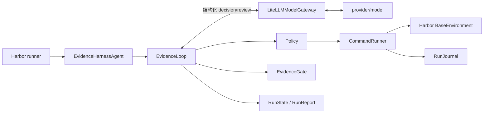

# Evidence Harness

Evidence Harness 是面向 Terminal-Bench 2.0 的 Harbor 自定义 Agent。它把“任务完成”
改造成控制器执行的证据协议：模型提出操作和验收条件，Harness 串行执行命令、保存观察、
重新运行最终检查，只有新鲜证据覆盖全部任务要求时才结束。

## 成绩

扩展矩阵覆盖 4 easy、10 medium、6 hard，共 20 个系统运维、软件工程、安全、数据处理、
科学计算和数学任务。

| 指标 | 当前结果 |
|---|---:|
| 已尝试 | 20 / 20 |
| Harbor reward 1.0 | 18 |
| 普通 verifier 失败 | 1 |
| 基础设施错误 | 1 |
| Attempted pass rate | 90% |
| Scored pass rate | 94.7% |
| Execution / scored coverage | 100% / 95% |

这不是同一模型的一次完整 20 题成绩。18 个通过结果由 17 个 live trial 和 1 个 journal
replay 组成；live trial 使用 GLM 5.3 与 `modelhub/gpt-5.6-terra`。评分失败
`vulnerable-secret` 被模型供应商的 `cyber_policy` 拒绝；唯一基础设施错误
`qemu-startup` 发生在 Apple Silicon 宿主的 Rosetta amd64 容器中。逐题模型、模式、
reward 和停止原因见[20 题冻结评测结果](evaluation/results-20.md)。

### 如何解读成绩

本项目同时报告两种通过率。Attempted pass rate 以全部已运行任务为分母，能暴露模型、
Harness 和基础设施共同造成的损失。Scored pass rate 只统计 verifier 正常给出评分的
任务，用于区分解题失败与运行环境错误。

| 分组 | 通过 | 失败 | 错误 | 结论 |
|---|---:|---:|---:|---|
| easy | 4 / 4 | 0 | 0 | 基础代码与调试任务全部通过 |
| medium | 8 / 10 | 1 | 1 | 唯一策略拒绝和唯一基础设施错误都在此组 |
| hard | 6 / 6 | 0 | 0 | 并发、服务配置、安全修复和科学计算任务全部通过 |
| GLM 5.3 live | 5 / 6 | 0 | 1 | `qemu-startup` 因运行环境失败 |
| Terra live | 12 / 13 | 1 | 0 | `vulnerable-secret` 被供应商策略拒绝 |
| journal replay | 1 / 1 | 0 | 0 | 只证明记录轨迹可复现，不代表新的模型推理 |

这 20 题不是随机抽样，也不是单模型对照实验。矩阵只根据公开 `task.toml` 的难度、类别
和标签确定；选样阶段不读取 solution 或 verifier。所有 live trial 使用并发 1。恢复
批次只重跑首次没有通过的四题，最终快照为每个任务保留一个明确来源。

### 实验结论

1. **证据门禁能减少无依据的提前结束，但门禁本身也会失败。** `fix-git` 的首轮解法
   已完成，旧策略却连续五次拒绝合法检查。修复命令解析后，同模型、同任务、同预算的
   turns 从 11 降到 4，repairs 从 5 降到 0，输入 token 减少 62.9%。
2. **外部 reward 与内部 `verified` 必须分开。** 17 个 live 通过任务中，10 个以
   `verified` 结束，7 个以 `budget_exhausted` 结束但仍获得 reward 1.0。这说明当前
   主要缺口已从“不会做题”转向“完成审查和只读策略不能稳定达成一致”。
3. **验证器必须按消费者语义读取产物。** `dna-assembly` 首轮内部状态为 `verified`，
   官方 verifier 却发现引物 Tm 差值超限。改为解析完整扩增产物、BsaI 位点和环形拼接
   后，恢复 trial 获得 reward 1.0。
4. **错误分类决定优化方向。** `query-optimize` 是算法和证据不足，修正后查询中位耗时
   比参考快 1.22 倍；Docker manifest EOF 是可重试的环境错误；QEMU 缺少 syscall 和
   KVM 是 runner 能力问题；`cyber_policy` 是模型通道边界。这四类问题不能用同一个
   “重试”策略处理。

## 核心亮点

- **完成声明必须带证据。** `finish` 给出一到三条检查命令和 requirement-to-check
  覆盖表。Harness 自己执行检查，模型不能用自然语言宣布成功。
- **证据绑定当前工作版本。** 每次变更推进 `work_epoch` 并使旧检查失效，避免
  “先测试、后改坏、仍然结束”。
- **最终验证有独立预算。** executor 不能把全部环境调用消耗在探索阶段。
- **单写者消除状态竞争。** 只有 `CommandRunner` 能操作 Harbor 环境；completion
  reviewer 只审查覆盖关系，不持有环境对象。
- **上下文按状态重建。** 每轮 prompt 从 `RunState`、计划、预算和有界观察生成。完整
  输出脱敏后进入 journal，prompt 只携带首尾摘录、摘要哈希和引用。
- **模型异常可恢复。** 空正文进入一次 schema repair；executor 和 reviewer 都有独立
  模型调用超时；重复失败会触发 replan 或分类停止。
- **报告不美化失败。** `passed`、`failed`、`error`、`not_run` 以及
  `live`、`replay` 分开统计。内部 `verified` 不能替代 Harbor reward。
- **结果可以从仓库复算。** `evaluation/trials-20/` 保存 20 个脱敏 trial 快照和原始
  结果 SHA-256，不保存 API 地址、凭证、绝对路径或 traceback。

## 工程方法与知识覆盖

开发过程使用了五项可追踪的 Skills：

| Skill | 在项目中的作用 |
|---|---|
| `show-me-your-work` | 把工程决定写入 TSV，并绑定证据和结果 |
| `principle-prove-it-works` | 要求真实 Harbor、Docker 和 verifier 结果 |
| `technical-writing` | 组织架构说明、评测方法和复现文档 |
| `write` | 中文化并统一报告语气 |
| `unslop` | 删除模板化表述和重复结论 |

20 道任务也扩大了技术覆盖。项目实际处理了 Coq 证明、Nginx、OpenSSL、ELF32/ELF64、
SQLite 查询优化、JSON/CSV/Parquet 合并、CWE-93、文件系统取证、Python 科学计算栈和
Golden Gate DNA assembly。每项只按本次任务的实现和验证结果陈述，不把一次评测写成
长期生产经验。完整记录见 [AI Coding 工程日志](docs/vibe-coding-log.md)。

## 架构

模型负责选择动作，Harness 负责执行、记账和决定是否终止。模型不能直接访问任务容器。



| 设计问题 | Evidence Harness 的实现 |
|---|---|
| Prompt 构造 | 原始任务 + 环境 bootstrap + 当前计划 + 预算 + 有界观察 + 严格动作 schema |
| 执行策略 | 轻量 plan-in-action；每轮选择 `execute`、`finish`、`replan` 或 `stop` |
| 错误恢复 | 命令分类、schema repair、模型超时、重复周期检测、恢复预算 |
| 上下文管理 | 从状态重建 prompt；大输出写 journal，只传摘录与 SHA-256 |
| 终止判断 | reviewer 审覆盖，Harness 重跑 checks，EvidenceGate 校验 epoch 与结果 |

完整状态机、组件职责、方案比较和取舍见[架构决策](docs/architecture-rationale.md)。

## 架构判断

Evidence Harness 的设计不是“让模型多思考几轮”，而是把不稳定的模型放进一个确定性的
控制器。模型负责提出下一步，控制器负责维护事实、执行副作用和裁决是否允许结束。

**选择单写者。** 只有 `CommandRunner` 可以修改任务环境。reviewer 不持有环境引用，
因此不会和 executor 并发写同一容器，也不能用自然语言伪造执行结果。这个选择牺牲并行
探索速度，换来可归因的命令序列和稳定的状态。

**选择状态投影，不保留无限对话。** 每轮 prompt 从 `RunState` 重建，只携带当前计划、
预算、最近观察和日志引用。完整输出进入脱敏 journal。模型需要旧细节时重新执行窄范围
查询，而不是让历史输出永久占用上下文。

**选择双重完成判定。** Harness 的 `EvidenceGate` 只判断完成声明是否有新鲜、可执行、
覆盖要求的证据。Harbor verifier 才决定 benchmark reward。两者分离后，报告可以识别
“任务已通过但 Harness 未收敛”和“内部已验证但外部产物错误”这两种相反问题。

**选择有限恢复。** schema repair、模型调用超时、命令失败分类和重复周期检测都有明确
预算。系统宁可返回可解释的 `model_failure` 或 `budget_exhausted`，也不无限重试并把
成本隐藏在长对话中。

## 安装

需要 Python 3.12、[`uv`](https://docs.astral.sh/uv/) 和可用的 Docker daemon。

```bash
uv sync --python 3.12
docker info
```

项目固定 `harbor==0.23.0`。模型凭证放在供应商环境变量或仓库外的 env 文件中；不要把
key 写入命令、README 或 Git。

创建权限为 `0600` 的临时 env 文件：

```bash
umask 077
read -rs EVIDENCE_HARNESS_KEY
printf 'OPENAI_API_KEY=%s\n' "$EVIDENCE_HARNESS_KEY" > /tmp/evidence-harness.env
unset EVIDENCE_HARNESS_KEY
```

## 运行评测

运行单题：

```bash
uv run harbor run \
  --dataset terminal-bench@2.0 \
  --include-task-name fix-git \
  --agent evidence_harness.harbor_agent:EvidenceHarnessAgent \
  --model provider/model \
  --n-concurrent 1
```

验证固定矩阵和 Harbor 参数，不调用模型：

```bash
uv run python scripts/run_evaluation.py \
  --model provider/model \
  --dry-run
```

串行运行固定 10 题：

```bash
uv run python scripts/run_evaluation.py \
  --model provider/model \
  --env-file /absolute/path/to/provider.env \
  --debian-https-sources
```

默认并发是 1。真实运行中，GLM 端点在并发 2 时出现过成批空响应和停滞。可重复传入
`--include-task-name` 运行矩阵子集。runner 接受任意非空矩阵，因此可以直接扩展到 20 题：

```bash
uv run python scripts/run_evaluation.py \
  --matrix evaluation/matrix-20.json \
  --model openai/modelhub/gpt-5.6-terra \
  --env-file /tmp/evidence-harness.env \
  --debian-https-sources \
  --agent-kwarg api_base=https://xpa-relay.bytedance.net/v1 \
  --agent-kwarg max_output_tokens=8192 \
  --agent-kwarg max_model_call_timeout_sec=360
```

`api_base` 必须停在 `/v1`。LiteLLM 会追加 `/chat/completions`，因此不要把完整请求路径
传给 `api_base`。`openai/` 是 LiteLLM provider 前缀，实际发送的模型名仍是
`modelhub/gpt-5.6-terra`。

评测预算可用 `--agent-kwarg max_turns=...`、
`--agent-kwarg max_environment_calls=...` 和
`--agent-kwarg max_wall_time_sec=...` 调整。

## 完整验收

一条命令运行 Ruff lint/format、mypy、pytest coverage、构建、两个 Harbor Agent
schema、10/20 题 dry-run、交付物检查、结果复算、凭证扫描，以及真实 mock-model +
Docker + Harbor verifier smoke：

```bash
uv run python scripts/verify_all.py
```

没有 Docker 时可仅跳过最后的 smoke：

```bash
uv run python scripts/verify_all.py --skip-smoke
```

从原始 Harbor 目录生成可提交的脱敏快照，再重建 10 题报告：

```bash
uv run python scripts/freeze_evaluation.py /path/to/harbor/job
uv run python scripts/summarize_results.py evaluation/trials \
  --json-out evaluation/results.json \
  --markdown-out evaluation/results.md
uv run python scripts/verify_delivery.py
```

20 题结果可以由多个互不重叠的 Harbor job 或单题 trial 目录合并。每个任务必须恰好
出现一次；冻结器会拒绝重复、缺失或矩阵外任务：

```bash
uv run python scripts/freeze_evaluation.py \
  runs/terminal-bench-2/<original-10-job> \
  runs/terminal-bench-2/<expanded-job>/<selected-trial> \
  runs/terminal-bench-2/<recovery-job>/<selected-trial> \
  --matrix evaluation/matrix-20.json \
  --output-dir evaluation/trials-20

uv run python scripts/summarize_results.py evaluation/trials-20 \
  --matrix evaluation/matrix-20.json \
  --json-out evaluation/results-20.json \
  --markdown-out evaluation/results-20.md
```

本地 smoke 使用固定 fixture 和确定性 mock server，只证明 Harness、Docker、Harbor 与
verifier 的集成链路，不计入 Terminal-Bench 成绩。

## 结果与限制

- 当前结果来自混合模型和一次 replay，不能解读为单模型排行榜成绩。
- `qemu-startup` 需要原生 x86_64 Linux 或支持相应系统调用与嵌套虚拟化的 runner。
- `vulnerable-secret` 连续两次被供应商 `cyber_policy` 拒绝。该结果反映当前模型通道的
  策略边界，不是 verifier 基础设施错误。
- `overfull-hbox` 与 `model-extraction-relu-logits` 已获 reward 1.0，但 reviewer 曾要求
  运行会生成 PDF、日志或 `.npy` 的检查。只读 policy 不允许它们写任务目录，因此内部
  状态为 `budget_exhausted`。正确改进是隔离验证工作区，不是放开任意写入。
- 扩展批次发现的 `query-optimize` 性能不足、Docker 拉取 EOF 和 `dna-assembly` 产物
  语义验证缺口均已通过独立 recovery trial 复测。

## 交付文档

- [架构决策](docs/architecture-rationale.md)
- [评测报告](docs/evaluation-report.md)
- [20 题逐题结果与统计口径](evaluation/results-20.md)
- [首批 10 题冻结结果](evaluation/results.md)
- [首批 10 题逐题分析](docs/ten-task-analysis.md)
- [新增 10 题逐题分析](docs/expanded-ten-analysis.md)
- [失败分析](docs/failure-analysis.md)
- [如果再给 10 小时](docs/next-10-hours.md)
- [AI Coding 工程日志](docs/vibe-coding-log.md)
- [独立 fix-git replay 结果](evaluation/replay-results.md)
