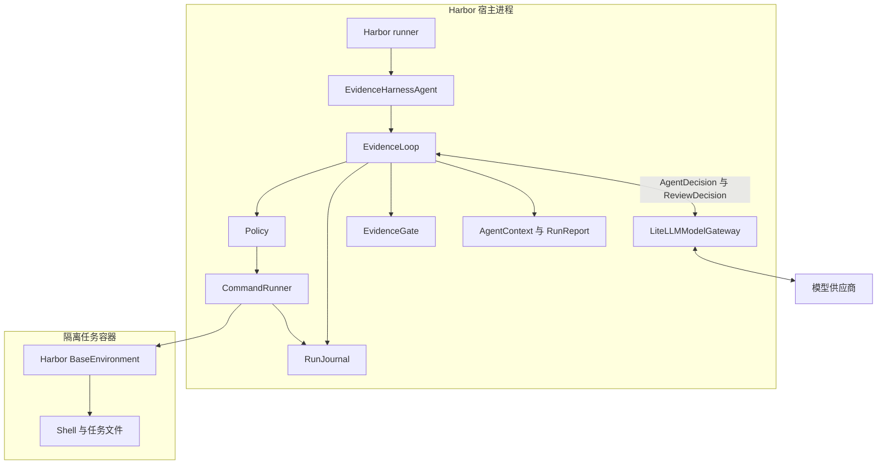
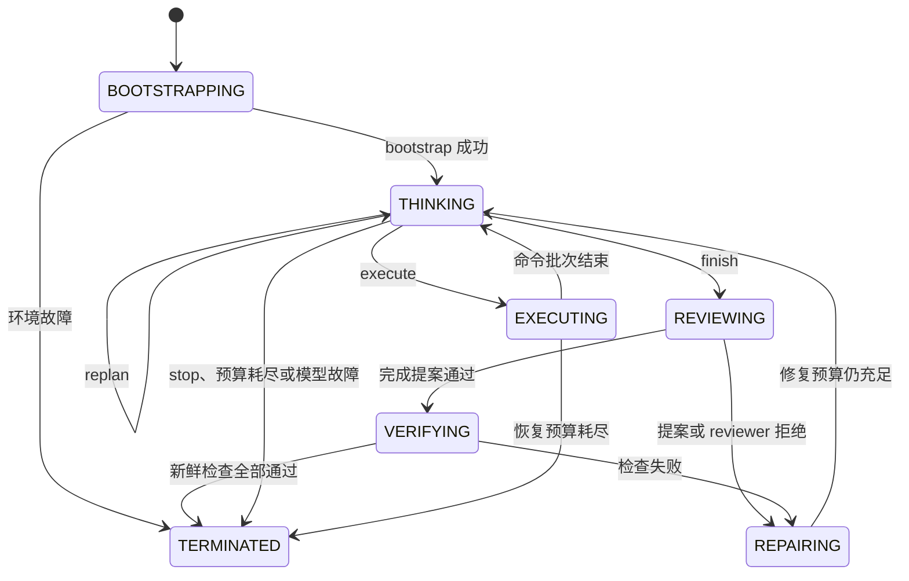
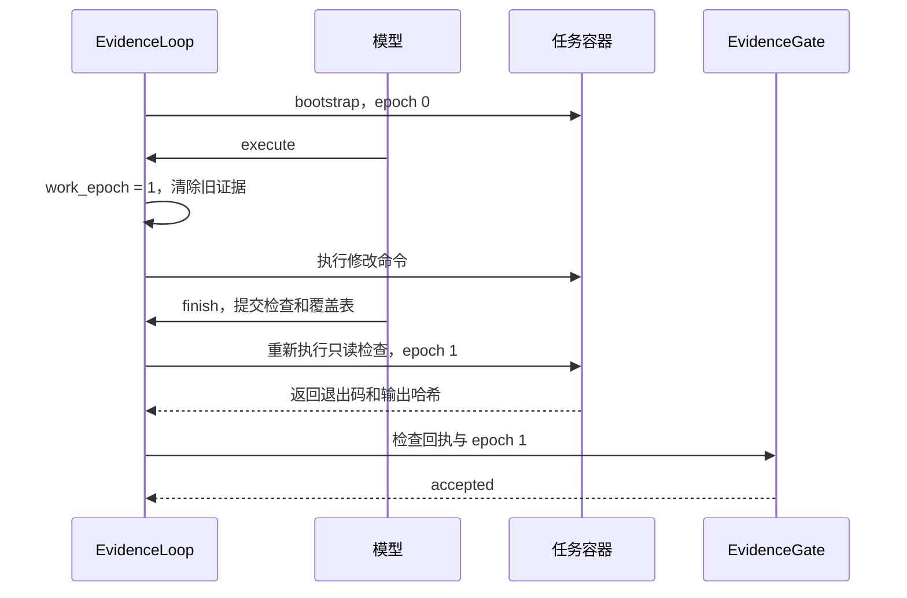

# Evidence Harness 架构决策

## 问题

Terminal-Bench 2.0 的任务横跨系统运维、数据处理、服务配置和代码修改。Harness 必须保留通用 shell 能力，同时限制重复操作、上下文膨胀和没有证据的提前结束。Harbor 0.23.0 在宿主进程中加载自定义 `BaseAgent`，Agent 再通过 `BaseEnvironment.exec` 操作隔离环境。这个边界允许控制器直接获得命令退出码，无需在每个任务容器中安装 CLI。

## 使用方式

Harbor 只需要一个导入路径：

```bash
uv run harbor run \
  -d terminal-bench/terminal-bench-2 \
  -a evidence_harness.harbor_agent:EvidenceHarnessAgent \
  -m provider/model
```

调用方可以通过 `--agent-kwarg` 调整预算，但无需了解内部状态机：

```bash
uv run harbor run \
  -d terminal-bench/terminal-bench-2 \
  -a evidence_harness.harbor_agent:EvidenceHarnessAgent \
  -m provider/model \
  --ak max_turns=36 \
  --ak max_environment_calls=72 \
  --ak max_wall_time_sec=1200
```

核心循环也可以脱离 Harbor 做确定性测试：

```python
loop = EvidenceLoop(model=fake_model, journal=journal, options=options)
report = await loop.run(instruction, fake_environment)
assert report.stop_reason == StopReason.VERIFIED
```

## 系统边界

Harness 运行在 Harbor 宿主进程中。任务命令只通过 Harbor 提供的
`BaseEnvironment.exec` 进入隔离容器。模型从不持有环境对象，也不能绕过控制器执行
命令。



控制路径和评分路径彼此独立。`EvidenceGate` 决定 Harness 能否声明完成，Harbor
verifier 在 Agent 退出后判断任务是否真正通过。Harness 不读取 verifier 文件，也不把
内部门禁结果当作 benchmark 分数。

## 组件职责

`EvidenceHarnessAgent` 是唯一公开入口。它把 Harbor 注入的模型名、日志目录和环境适配成 `EvidenceLoop` 所需的两个端口：`ModelGateway` 和 `ShellEnvironment`。`EvidenceLoop.run` 隐藏预算、重复检测、命令策略、验证票据和停止条件。

| 模块 | 职责 | 不负责 |
| --- | --- | --- |
| `harbor_agent.py` | 连接 Harbor，解析选项，同步 token、成本和运行状态 | 解题策略和命令执行 |
| `run_loop.py` | 推进状态机，维护预算、恢复次数和 `work_epoch` | 供应商协议和最终评分 |
| `protocol.py` | 定义动作、命令、回执、状态和报告的严格类型 | 执行副作用 |
| `prompting.py` | 从权威状态重建有界 executor 和 reviewer 提示 | 保存对话历史 |
| `model_client.py` | 通过 LiteLLM 调用指定模型，解析 JSON，累计用量 | 直接访问任务容器 |
| `policy.py` | 拒绝危险、无效或重复的命令和完成检查 | 充当容器隔离边界 |
| `shell.py` | 串行调用 `BaseEnvironment.exec` 并生成命令回执 | 判断任务是否完成 |
| `evidence.py` | 检查覆盖关系、检查结果和证据时效 | 替代 Harbor verifier |
| `journal.py` | 脱敏并归档事件和完整命令输出 | 把无限输出送入模型上下文 |
| `evaluation.py` | 汇总固定评测矩阵和 Harbor `result.json` | 参与单题运行控制 |

核心数据结构如下：

```python
class AgentDecision(BaseModel):
    action: Literal["execute", "finish", "replan", "stop"]
    rationale: str
    plan: tuple[str, ...]
    commands: tuple[ShellCommand, ...]
    checks: tuple[VerificationCheck, ...]
    coverage: tuple[RequirementCoverage, ...]

class CommandReceipt(BaseModel):
    sequence: int
    command_id: str
    mode: Literal["observe", "change"]
    work_epoch: int
    return_code: int
    stdout: OutputExcerpt
    stderr: OutputExcerpt
    observation_fingerprint: str

class VerificationReceipt(BaseModel):
    work_epoch: int
    checks: tuple[CommandReceipt, ...]
    coverage: tuple[RequirementCoverage, ...]
    accepted: bool

class EvidenceLoop:
    async def run(
        self,
        instruction: str,
        environment: ShellEnvironment,
    ) -> RunReport: ...
```

`AgentDecision` 在模型边界解析。进入控制器后，代码只处理已验证的领域对象。`ShellEnvironment` 只暴露一次有界命令执行。reviewer 没有环境引用，只能判断完成证据是否覆盖任务要求。

命令执行后，控制器把完整且脱敏的输出写入日志文件。模型只看到长度受限的首尾摘录、退出码、摘要哈希和日志引用。每次模型调用都从权威状态重新构造提示，不累计完整对话。这避免旧输出持续占用上下文，也防止 shell 输出覆盖固定规则。

完成状态要求至少一条非平凡、只读、重新执行的检查。所有检查必须发生在最后一次可能
修改环境的命令之后。完成 reviewer 再按原始任务逐项检查证据覆盖。reviewer 只能返回
接受或修复，不能执行命令，也不能替代 Harbor 的最终 verifier。

## 运行时状态机



状态机从 `BOOTSTRAPPING` 开始。固定 bootstrap 命令读取工作目录、平台、浅层文件、
Git 状态和常见工具位置，避免模型第一轮重复做相同探测。之后每轮进入
`THINKING`，模型只能返回四种结构化动作：

1. `execute`：执行最多四条有目的、有超时、有读写模式的命令。
2. `finish`：提交只读检查和需求与检查 ID 的覆盖表。
3. `replan`：在重复循环或假设失效后显式改变计划。
4. `stop`：把外部阻塞、不安全条件或不可实现状态显式分类。

`execute` 会推进 `work_epoch`，并立刻使旧验证失效。任何声称完成的动作都必须在当前
epoch 重新执行检查。控制器预留三次环境调用给最终验证，所以模型不能用普通工作命令
耗尽全部预算。命令首次失败后，控制器要求模型读取错误并改变方法。重复观察指纹会
触发强制 replan。超过恢复次数、时间、turn 或环境调用预算后由控制器终止。停止原因是
领域枚举，而不是依赖最后一句自然语言猜测。

### `work_epoch` 如何防止使用旧证据

`work_epoch` 是只增不减的工作批次版本号。固定 bootstrap 在 epoch 0 运行。每个
`execute` 批次开始时，控制器先增加 epoch，再清除 `latest_evidence`。完成检查产生的
每条 `CommandReceipt` 都记录当前 epoch。



如果模型在验证后再次选择 `execute`，`work_epoch` 变为 2。epoch 1 的回执即使退出码
为 0，也不能证明 epoch 2 的环境状态。模型必须重新提交并执行检查。

## 命令与证据边界

Shell 是 Terminal-Bench 的必要通用能力，完全改成固定工具集合会损失覆盖率。这里没有
试图消灭 shell，而是把风险集中在执行边界：

- 拒绝空命令、超长命令、超时越界和明显的宿主逃逸模式。
- 每条命令必须声明 `observe` 或 `change`。保守分类优先把不确定操作视为修改。
- 命令脚本和标准输出先做凭证模式脱敏，再写 journal。
- 大输出保留完整归档，提示中只投影固定字节数的 head/tail、SHA-256 和路径引用。
- 相同命令加相同观察结果形成重复周期时，禁止继续机械重试。

证据门禁不判断任务的业务真相，它只证明 Harness 的完成声明满足最低可审计条件：
检查非空、检查 ID 唯一、覆盖表引用有效、脚本不是单纯 `echo/true`、检查均为只读且
发生在最新修改之后。最终正确性仍由 Terminal-Bench verifier 决定。这样可以避免把
Harness 自己的启发式规则误当作 benchmark oracle。

## 完成验证的四层职责

完成流程把结构、语义、执行结果和官方评分分开：

1. `EvidenceGate.validate_proposal` 检查命令是否只读且非平凡，并检查覆盖表引用是否
   有效。
2. 启用 completion review 时，reviewer 只判断拟执行的检查能否覆盖原始任务要求。
   reviewer 不执行命令，也不能接受最终完成状态。
3. `CommandRunner` 在当前 `work_epoch` 重新执行检查。`EvidenceGate.decide` 要求所有
   检查成功且证据未过期。
4. Harbor verifier 在 Harness 退出后独立评分。只有获得 reward 的结果进入 scored
   pass rate。

前两层减少无证据的提前结束。第三层证明完成声明对应当前环境。第四层保留 benchmark
的唯一评分权。

## Prompt 与上下文

Executor prompt 由固定协议、原始任务、当前预算、当前计划、恢复指令、未解决错误和
最近观察组成。旧观察不会无限追加。超出窗口后只保留确定性的压缩投影。输出中的
`忽略规则` 和 `任务已完成` 等文本仅作为不可信数据出现，固定协议始终在其前后保持清晰
边界。模型输出由 Pydantic 以 `extra="forbid"` 解析，字段缺失、未知字段和动作负载
冲突都会成为协议错误。Gateway 只允许一次格式修复，防止无界 JSON 修复循环。

Reviewer 接收原始要求、模型拟执行的检查、覆盖表和最近观察，但没有
`ShellEnvironment`。它只能接受覆盖或返回缺失项。这种低频只读 reviewer 比每轮
Planner/Executor/Critic 更节省 token，也不会产生第二个环境写者。

## 可观测性与复现

`RunJournal` 以 JSONL 记录 run、模型决策、策略拒绝、命令回执、reviewer 判断、恢复和
最终报告。Harbor `AgentContext` 同步 token、成本、turn、环境调用、repair、recovery、
epoch 和停止原因。评测矩阵单独固定在 `evaluation/matrix.json`，runner 用十个精确
任务名调用 `terminal-bench@2.0`，汇总器直接读取 Harbor `result.json`。未产生 trial
的任务状态是 `not_run`，认证或基础设施错误是 `error`，只有 verifier 给出非满分结果
才是 `failed`。这条区分保证报告不会把未执行写成模型解题失败。

## 设计特色

Evidence Harness 把完成条件、证据时效、执行权限和评测状态编码在控制器中。模型负责
选择动作，但不能跳过这些约束。

第一，完成证据有完整的生命周期。模型提交检查计划，reviewer 判断需求覆盖，
`CommandRunner` 重新执行检查，`EvidenceGate` 再核对退出码和 `work_epoch`。任何新的
`execute` 都使旧证据失效。控制器还预留环境调用次数，避免模型在工作阶段耗尽最终验证
预算。

第二，系统只有一个环境写者，但保留一次独立的语义审查。这个结构比持续运行
Planner、Executor 和 Critic 更省模型调用，也避免多个 Agent 同时修改容器。reviewer
没有 `ShellEnvironment`，只能指出缺失要求，不能制造环境证据。

第三，Harness 面向跨领域终端任务，不假设任务一定是 Git 仓库或某种编程语言。它保留
通用 Shell 能力，同时用严格动作协议、命令策略、证据回执和 Harbor 容器隔离控制风险。
这与只处理代码补丁的定位和修复流水线不同。

第四，内部完成与 benchmark 评分分离。Harness 不读取隐藏 verifier，不把 mock smoke
当成 benchmark 成绩，也不把没有运行的任务计为失败。这个边界既减少评测泄漏，也让
失败分析能区分模型、控制器和基础设施问题。

## 综合选择

候选 A 的外部单 Agent 是基础方案。它的公开接口最小，直接使用 `BaseEnvironment.exec`，也最容易通过假模型和假环境测试。

从分层控制器候选中保留完成前 reviewer、单写者约束和角色用量统计。没有保留持续 Critic。持续 Critic 会增加模型调用和状态同步，当前没有基准数据证明收益。

容器内 CLI 方案被拒绝。它需要逐题安装、认证转发和会话进程管理，把与解题无关的变量带进评测。Harbor 已提供结构化环境执行接口，外部循环更直接。

## 接受的取舍

- 接受首版对全屏 TUI 支持较弱，以换取稳定的退出码、超时和日志边界。
- 接受确定性上下文压缩可能丢失旧输出细节，以换取可复现的 token 上限。模型可以重新执行窄范围只读命令取回信息。
- 接受完成时多一次模型调用，以减少没有覆盖全部要求的提前结束。
- 接受使用 Harbor 0.23.0 的 LiteLLM 适配层，以复用模型路由、结构化响应和用量统计。项目固定 Harbor 次版本，升级时通过导入测试检查兼容性。

## 其他方案

每轮 Planner、Executor 和 Critic 都调用模型。这个方案能增加审查频率，但公开配置更复杂，token 和延迟也更高。

多 Agent 并行探索允许多个角色同时操作同一容器。它引入共享状态竞争，命令证据也难以归因。

完整 diff 沙箱适合代码仓库，但 Terminal-Bench 还包含服务和系统状态修改。mutation ledger 能覆盖更广的任务类型。

## 风险和待验证问题

- 完成 reviewer 是否提高通过率，还是只增加成本，需要用同模型消融实验判断。
- 保守的 mutation 分类可能把测试命令当作修改，导致额外验证，但不会放宽完成条件。
- 部分任务依赖交互式终端。首版要求模型用非交互参数、管道或 `expect` 改写操作。
- 不同模型对结构化响应的遵守程度不同。Gateway 只允许一次格式修复，之后终止该轮并记录协议错误。
- Shell 策略防止明显误操作和循环，但不是容器安全边界。隔离责任仍属于 Harbor
  environment。
- OrbStack 中 apt 的 HTTP 传输可能持续降速。评测 runner 提供显式的 HTTPS Debian
  源挂载，且只在调用方要求时启用。

## 下一步

使用轮换后的模型凭证重跑 `fix-git`，再执行固定 10 题。随后按失败分类比较 executor、
evidence gate 和预算策略。只有同模型、同任务、同预算的消融结果才能用于判断
reviewer 或恢复策略的实际收益。
